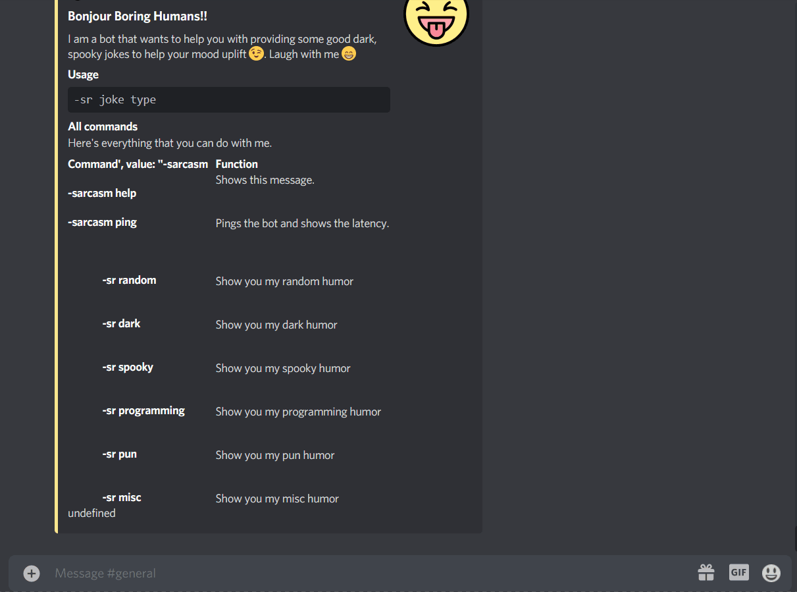

# Sarcaster
<p align="center">

</p>
<h1 align = "center"> Sracaster </h1>

<p align="center">
   
   
  
 </p>

<p align="center">Free discord bot to uplift your mood with some great humor 😜 </p>

<br>

## Overview
<p align="center">
  
With this discord bot you and your friends will have a great time spending time on discord with some some dank jokes
  
</p>

<br>
<br>

<p align="center">

</p>

<br>

## How to use

To get a humor via Sarcaster:<br> <br>
**```-sr joke_type```**

<br>
<br>

## Commands

|    Command     |    Description    |
| ------------- | ------------- |
| -sarcasm  | Shows the help embed.  |
| -sarcasm help  | Shows the help embed. |
| -sr random | Will throw you a random joke.|
| -sr dark | Will throw you a dark joke.|
| -sr spooky | Will throw you a spooky joke.|
| -sr programming | Will throw you a programming joke.|
| -sr pun | Will throw you a pun joke.|
| -sr misc | Will throw you a misc joke.|
| -sr ping | Pings the bot and shows it's latency.|

<br>
<br>

## Installation

<br>

The installation is simple :), you **do NOT need to know** how to code to get the bot up and running. Just follow these steps:

<br>


1. Make sure you have [Node.js](https://nodejs.org/en/download/package-manager/) and npm installed.
2. Clone the repository and then navigate to it in your terminal.
3. Create a ```.env``` file with the following contents: <br>

```BOTTOKEN='Your secret bot token'``` <br>

For this you have to create a sample bot on the discord developer portal obtain the secret bot token, put it in the ```.env``` file and then invite the sample bot to your server. 

4. Enter ```npm install``` to install the dependencies.
5. Enter ```node bot.js``` to run the bot. The bot should be online on your server in a few seconds.
6. Enjoy!

<br>
<br>

🔴 Copyright ©  2021 Akshat Srivastava
